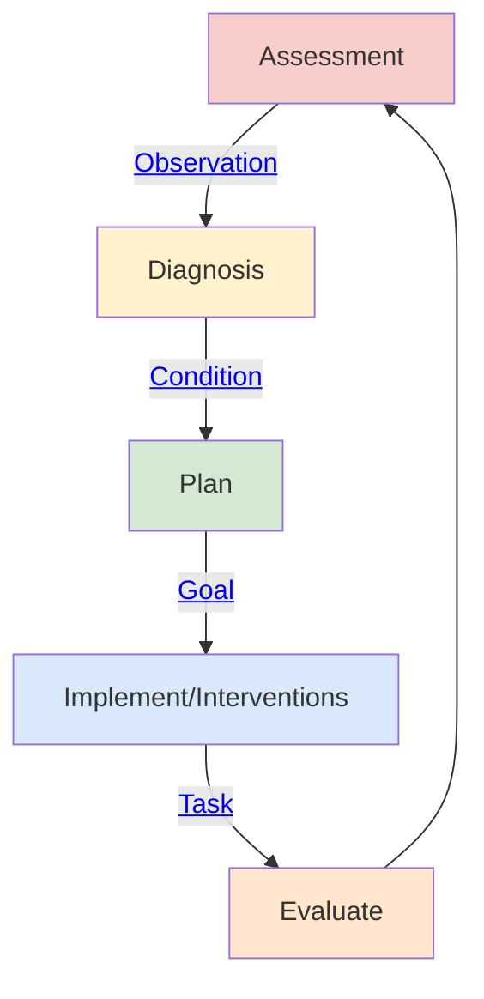

## Patient Care Coordination (PCC)

### Clinical Process

The `Patient Care Coordination (Community)` is designed around supporting clinical processes in primary, pharmacy and community care settings. It is aligned with [Nursing Process (ADPIE)](https://en.wikipedia.org/wiki/Nursing_process)

 

Nursing Process (ADPIE)
 

This uses a series of common data and interaction standards (green in the diagram below) which allow different applications to be connected together. These interfaces will often provide a layer of extraction of over other interfaces such as:

- [Consultation Note](consultation-note.html)
  - GP Connect Send Document
  - NHS England Digital Medicines
  - NHS England IM1 Transaction API
- [Referral Letter](referral-letter.html)
  - NHS England Booking and Referral Standard (BARS)
  - NHS England Electroninc Referral System (eRS)
- Patient Clinical Data Sharing
  - GP Connect Access Record: HTML
  - GP Connect Access Record: Structured
  - GP Connect Access Record: Document
  - NHS England IM1 Transaction API
- Care and Patient Directory 
  - NHS England Personnel Demographic Service (PDS)
  - Directory of Service (DoS)
  - Organisation Data Service
  - Spine Directory Service

<table style="width:80%">
  <tr>
    <td>
       
      
Patient Care Coordination Manager (Community)
   
    </td>
  </tr>
</table>

### Enterprise and Data Standards

#### Enterprise Frameworks

A number of frameworks [IHE Patient Care Coordination (PCC)](https://profiles.ihe.net/PCC/index.html) are followed in this guide, including:

- [Query for Existing Data for Mobile (QEDm)](https://profiles.ihe.net/PCC/QEDm/index.html)
- [Dynamic Care Planning (DCP)](https://www.ihe.net/uploadedFiles/Documents/PCC/IHE_PCC_Suppl_DCP.pdf)
- [Mobile access to Health Documents (MHD)](https://profiles.ihe.net/ITI/MHD/index.html) (A REST API for IHE XDS.b and EDMS)
- [Mobile Care Services Discovery (mCSD)](https://profiles.ihe.net/ITI/mCSD/volume-1.html)
- [Patient Demographics Query for Mobile (PDQm)](https://profiles.ihe.net/ITI/PDQm/index.html)

#### Technical Workflow 

The interactions use HL7 FHIR and is designed to be compatible with:

- HL7 v2 Messaging via: 
  - [FHIR Messaging](https://hl7.org/fhir/R4/messaging.html) - a direct conversion of HL7 v2 Messaging
  - [HL7 FHIR Workflow](https://hl7.org/fhir/R4/workflow.html) which allows [Conversation Patterns](https://www.enterpriseintegrationpatterns.com/patterns/conversation/)
  - [HL7 FHIR Subscription](https://build.fhir.org/ig/HL7/fhir-subscription-backport-ig/)
- HL7 Clinical Document Architecture via: 
  - [FHIR Documents](https://hl7.org/fhir/R4/documents.html)

#### Data Standards

Support for these frameworks includes core [canonical data model](https://www.enterpriseintegrationpatterns.com/patterns/messaging/CanonicalDataModel.html)/[domain model](https://martinfowler.com/eaaCatalog/domainModel.html) which meets general NHS requirements:

- [UK SNOMED CT](https://digital.nhs.uk/services/terminology-and-classifications/snomed-ct) for our clinical terminology.
- [NHS Data Dictionary](https://www.datadictionary.nhs.uk/) for identifiers and values, such as NHS Number, GMC, GMP, ODS, etc. 
- [HL7 UK Core](https://simplifier.net/HL7FHIRUKCoreR4/).

### SNOMED CT

UK edition of SNOMED (83821000000107)

### Dependencies



## Credits

| Role(s)              | Contributor(s)                             | 
|----------------------|--------------------------------------------|
|                      | [Virtually Healthcare](https://virtually.healthcare/)                   |
| Enterprise Architect | **Kevin Mayfield** (Mayfield IS)           |      
