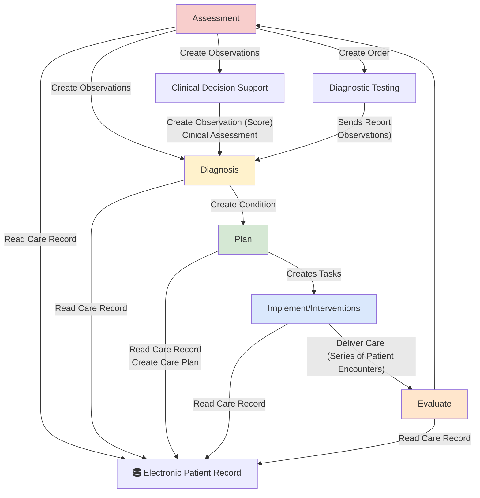
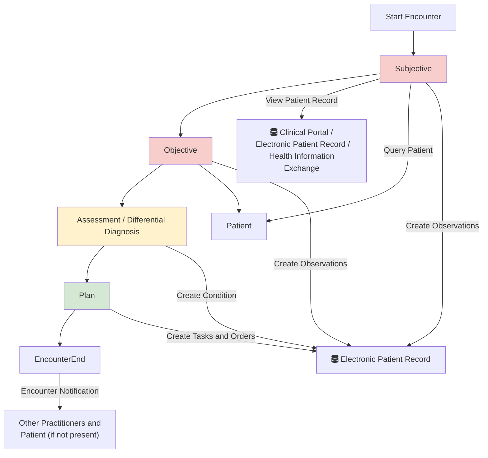

## Patient Care Coordination (PCC)

### How to Read this IG

<table >
  <thead>
    <tr>
      <th></th>
      <th>Menu Item</th>
      <th>Description</th>
      <th>Audience</th>
    </tr>
  </thead>
  <tbody>
    <tr>
      <td style="background-color: #E1D5E7">&nbsp;&nbsp;</td>
      <td>Analysis and Design (Volume 1)</td>
      <td>Description of the processes and corresponding technical frameworks</td>
      <td>General</td>
    </tr>
    <tr>
      <td style="background-color: #F8CECC">&nbsp;&nbsp;</td>
      <td>Interfaces (Volume 2)</td>
      <td>Description of the processes and corresponding technical frameworks (HL7 v2 and FHIR Interactions)</td>
      <td>Detailed Technical (Integration Developer)</td>
    </tr>
    <tr>
      <td style="background-color: #DAE8FC">&nbsp;&nbsp;</td>
      <td>Domain Archetype (Volume 3)</td>
      <td>Forms, Templates, Reports and Compositions</td>
      <td>Data Modeling (Detailed Technical)</td>
    </tr>
    <tr>
      <td style="background-color: #DAE8FC">&nbsp;&nbsp;</td>
      <td>Artefacts (Volume 4)</td>
      <td>Common Data Models</td>
      <td>Detailed Technical</td>
    </tr>
    <tr>
      <td style="background-color: #DAE8FC">&nbsp;&nbsp;</td>
      <td>Development</td>
      <td>Testing, Suppport and Architecture</td>
      <td>Detailed Technical (Developer)</td>
    </tr>
  </tbody>
</table>

### Clinical Process

The `Patient Care Coordination (Community)` is designed around supporting clinical processes in primary, pharmacy and community care settings. It is aligned with [Nursing Process (ADPIE)](https://en.wikipedia.org/wiki/Nursing_process)

 

Nursing Process (ADPIE)
 

| Patient Care Process        | Analysis and Design                                  | Interfaces                                                                                                                         | Domain Archetype                                                                                                                                                                                                                         | Domain Entity (Resources)                                                                                   |
|-----------------------------|------------------------------------------------------|------------------------------------------------------------------------------------------------------------------------------------|------------------------------------------------------------------------------------------------------------------------------------------------------------------------------------------------------------------------------------------|-------------------------------------------------------------------------------------------------------------|
| Assessment                  |                                                      | Device Dats Capture   [Structured Data Capture](Stuctured Data Capture)                                                        | [Vital Signs](Questionnaire-VitalSigns.html)   [Physical Activity](Questionnaire-DailyPhysicalActivity.html)   [Exercise Activity](Questionnaire-ExerciseActivity.html)   [Social Context](Questionnaire-SocialContext.html) | [Observation](StructureDefinition-Observation.html)                                                         |
| - Clinical Decision Support | [Clinical Assessment ACDC](clinical-assessment.html) |                                                                                                                                    |                                                                                                                                                                                                                                          | [Observation](StructureDefinition-Observation.html)   [Clinical Assessment](StructureDefinition-ClinicalImpression.html)                           |
| Diagnosis                   |                                                      |                                                                                                                                    |                                                                                                                                                                                                                                          | [Condition](StructureDefinition-Condition.html)                                                             |
| Plan                        |                                                      |                                                                                                                                    |                                                                                                                                                                                                                                          | [Goal](StructureDefinition-Goal.html)   [Care Plan](StructureDefinition-CarePlan.html)                  |
| Implement                   |                                                      |                                                                                                                                    |                                                                                                                                                                                                                                          | [Task](StructureDefinition-Task.html)   [MedicationRequest](StructureDefinition-MedicationRequest.html) |
| - Order                     | [Patient Referral 360X](360X.html)                   |                                                                                                                                    | [Referral Letter](Questionnaire-PatientReferral.html)                                                                                                                                                                                    |                                                                                                             |
| - Report/Consultation Note  | [Patient Referral 360X](360X.html)                   |                                                                                                                                    | [Consultation Note](StructureDefinition-ConsulationNote.html)                                                                                                                                                                            |                                                                                                             |
| Evaluate                    |                                                      |                                                                                                                                    |                                                                                                                                                                                                                                          |                                                                                                             |
| Electronic Patient Record   | [Health Information Exchange HIE](HIE.html)          | [IHE Query for Existing Data QEDm PCC-44](https://profiles.ihe.net/PCC/QEDm/PCC-44.html)   [IHE Health Documents MHD ITI-67](https://profiles.ihe.net/ITI/MHD/ITI-67.html) | [Patient Care Record / Patient Summary](StructureDefinition-PatientCare.html)                                                                                                                                                            | Varies [Resources](artifacts.html#structures-resource-profiles)                                             |                                                                                        |

### Patient Encounters

Patient Encounters occur multiple times throughout a patient’s care journey and may be repeated at various stages. The diagram below illustrates that each encounter involves several steps — it’s a flexible, iterative process. To make this clearer for both developers and non-clinical users, the  [SOAP Notes](https://en.wikipedia.org/wiki/SOAP_note)
framework has been used as a reference.

While this description reflects a physician-centered workflow, the [clinical process](#clinical-process) is more closely aligned with nursing practices.

The data archetype associated with this is [Consultation Note](StructureDefinition-ConsulationNote.html) 

Event notifications are common in secondary care, where they are known as **HL7 v2 Admission, Discharge and Transder (ADT)** and also [IHE Patient Administration Management (PAM) - Patient Encounter](https://profiles.ihe.net/ITI/TF/Volume1/ch-14.html#14.2.1). *Note that HL7 FHIR does not currently define a specific standard for these event notifications.*
Some general practice (GP) systems do, however, receive such encounter notifications from secondary care.

## Technical Overview

### High Level Architecture

The diagram below shows the high level architecture of the Patient Care Coordination Manager (Community)

<table style="width:80%">
  <tr>
    <td>
       
      
Patient Care Coordination Manager (Community)
   
    </td>
  </tr>
</table>

This uses a series of common data and interaction standards (green in the diagram below) which allow different applications to be connected together. These interfaces will often provide a layer of extraction of over other interfaces such as:

- [Consultation Note](consultation-note.html)
    - GP Connect Send Document
    - NHS England Digital Medicines
    - NHS England IM1 Transaction API
- [Referral Letter](referral-letter.html)
    - NHS England Booking and Referral Standard (BARS)
    - NHS England Electroninc Referral System (eRS)
- Patient Clinical Data Sharing
    - GP Connect Access Record: HTML
    - GP Connect Access Record: Structured
    - GP Connect Access Record: Document
    - NHS England IM1 Transaction API
- Care and Patient Directory
    - NHS England Personnel Demographic Service (PDS)
    - Directory of Service (DoS)
    - Organisation Data Service
    - Spine Directory Service

### Enterprise Frameworks

A number of frameworks [IHE Patient Care Coordination (PCC)](https://profiles.ihe.net/PCC/index.html) are followed in this guide, including:

- [Query for Existing Data for Mobile (QEDm)](https://profiles.ihe.net/PCC/QEDm/index.html)
- [Dynamic Care Planning (DCP)](https://www.ihe.net/uploadedFiles/Documents/PCC/IHE_PCC_Suppl_DCP.pdf)
- [Mobile access to Health Documents (MHD)](https://profiles.ihe.net/ITI/MHD/index.html) (A REST API for IHE XDS.b and EDMS)
- [Mobile Care Services Discovery (mCSD)](https://profiles.ihe.net/ITI/mCSD/volume-1.html)
- [Patient Demographics Query for Mobile (PDQm)](https://profiles.ihe.net/ITI/PDQm/index.html)

#### Technical Workflow 

The interactions use HL7 FHIR and is designed to be compatible with:

- HL7 v2 Messaging via: 
  - [FHIR Messaging](https://hl7.org/fhir/R4/messaging.html) - a direct conversion of HL7 v2 Messaging
  - [HL7 FHIR Workflow](https://hl7.org/fhir/R4/workflow.html) which allows [Conversation Patterns](https://www.enterpriseintegrationpatterns.com/patterns/conversation/)
  - [HL7 FHIR Subscription](https://build.fhir.org/ig/HL7/fhir-subscription-backport-ig/)
- HL7 Clinical Document Architecture via: 
  - [FHIR Documents](https://hl7.org/fhir/R4/documents.html)

#### Data Standards

Support for these frameworks includes core [canonical data model](https://www.enterpriseintegrationpatterns.com/patterns/messaging/CanonicalDataModel.html)/[domain model](https://martinfowler.com/eaaCatalog/domainModel.html) which meets general NHS requirements:

- [UK SNOMED CT](https://digital.nhs.uk/services/terminology-and-classifications/snomed-ct) for our clinical terminology.
- [NHS Data Dictionary](https://www.datadictionary.nhs.uk/) for identifiers and values, such as NHS Number, GMC, GMP, ODS, etc. 
- [HL7 UK Core](https://simplifier.net/HL7FHIRUKCoreR4/).

### SNOMED CT

UK edition of SNOMED (83821000000107)

### Dependencies



## Credits

| Role(s)              | Contributor(s)                             | 
|----------------------|--------------------------------------------|
|                      | [Virtually Healthcare](https://virtually.healthcare/)                   |
| Enterprise Architect | **Kevin Mayfield** (Mayfield IS)           |      
